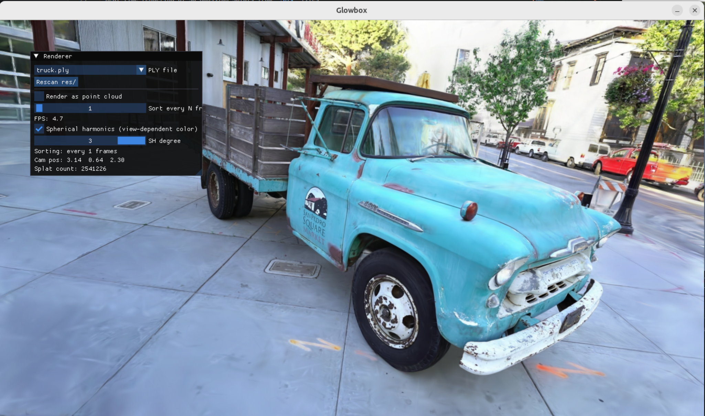

# Gaussian Splatting 3D Renderer
A real-time 3D Gaussian Splatting renderer built in C++ and OpenGL. This project is mostly based on the [3D Gaussian Splatting rasterizer](https://github.com/graphdeco-inria/diff-gaussian-rasterization.git) from the paper [3D Gaussian Splatting for Real-Time Rendering of Radiance Fields](https://repo-sam.inria.fr/fungraph/3d-gaussian-splatting/), loading trained scene representations from `.ply` point cloud files and rendering them interactively using OpenGL and GLSL shaders.
Built as part of the NTNU course **TDT4230 – Graphics and Visualization**, extending the [TDT4230 base framework](https://github.com/bartvbl/TDT4230-Assignment-1).


## Results
### bicycle scene
 \
My renderer on the bicycle scene from the original paper.

### garden scene
 \
My renderer on the garden scene from the original paper

### truck scene
 \
Here you can see the program with the UI on the truck scene.
You can pick one of the scenes from your res folder, toggle on and off point cloud rendering, adjust how often the scene is sorted and adjust degree of the spherical harmonic coloring. 

## Features
- Real-time rendering of 3D Gaussian Splats from `.ply` files
- GLSL-based splatting pipeline with compute (for GPU sorting), vertex and fragment shaders
- Interactive camera navigation 
- W, A, S, D for moving forward, left, backward and right
- Q, E for moving up and down
- Left click and drag to rotate camera

## Scenes
A sample scene (`cactus.ply`) is included in the `res/` folder and will work out of the box.

For larger scenes, download from one of the following sources and place the `.ply` files in the `res/` folder:

- **Full dataset** (all scenes from the paper, large download ~7GB):  
  [repo-sam.inria.fr/fungraph/3d-gaussian-splatting/evaluation/images.zip](https://repo-sam.inria.fr/fungraph/3d-gaussian-splatting/evaluation/images.zip)

- **Individual scenes** (pick and choose via Google Drive):  
  [drive.google.com/drive/folders/1WXCpR3kshQt2jmOtuCBsHKfzt1IMqey2](https://drive.google.com/drive/folders/1WXCpR3kshQt2jmOtuCBsHKfzt1IMqey2)

## Requirements
### Linux
- GCC or Clang (C++14 or newer)
- CMake 3.6+
- Git
- Python 3 — used during the build process to generate GLAD bindings


### Windows (Not tested and based on the TDT4230 code this code extends)
- Microsoft Visual Studio (with C++ workload)
- CMake (GUI or command-line)

---

## Building and Running
### Linux (recommended)
Clone the repository with submodules:
```bash
git clone --recursive https://github.com/paulHMorud/Gaussian-Splatting-3D-Renderer.git
cd Gaussian-Splatting-3D-Renderer
```
If you forgot `--recursive`, initialize submodules manually:
```bash
git submodule update --init
```
Then build and run:
```bash
make run
```
This is equivalent to:
```bash
git submodule update --init
cd build
cmake ..
make
./glowbox
```


#### Other build targets
| Target | Description |
|--------|-------------|
| `make run` | Build and run (release mode) |
| `make run-debug` | Build and run in debug mode (requires GDB) |
| `make run-prof` | Build and run with profiling info |
| `make build` | Build only |
| `make clean` | Remove build artifacts |
| `make help` | List all available targets |

### Windows (Not tested)

---

## Dependencies
All C++ dependencies are included as git submodules under `lib/`

| Library | Purpose |
|---------|---------|
| [GLFW](https://github.com/glfw/glfw) | Window creation and input |
| [GLAD](https://github.com/Dav1dde/glad) | OpenGL function loader |
| [GLM](https://github.com/g-truc/glm) | OpenGL mathematics |
| [STB](https://github.com/nothings/stb) | Image loading utilities |
| [lodepng](https://github.com/lvandeve/lodepng) | PNG encoding/decoding |
| [arrrgh](https://github.com/ElectricToy/arrrgh) | Argument parsing |
| [SFML](https://github.com/SFML/SFML) | Audio playback |
| [fmt](https://github.com/fmtlib/fmt) | String formatting |
| [Dear ImGui](https://github.com/ocornut/imgui) | Immediate-mode GUI |
| [PCL](https://pointclouds.org/) | Point cloud / `.ply` file I/O |

---

## Background
3D Gaussian Splatting is a scene representation technique introduced in the SIGGRAPH 2023 paper:

> Kerbl et al., *"3D Gaussian Splatting for Real-Time Radiance Field Rendering"*, SIGGRAPH 2023.

Scenes are represented as a collection of 3D Gaussians, each with a position, scale, rotation, opacity, and color (encoded via spherical harmonics). Rendering is done by projecting and splatting each Gaussian onto the 2D screen using a fast rasterization pipeline.